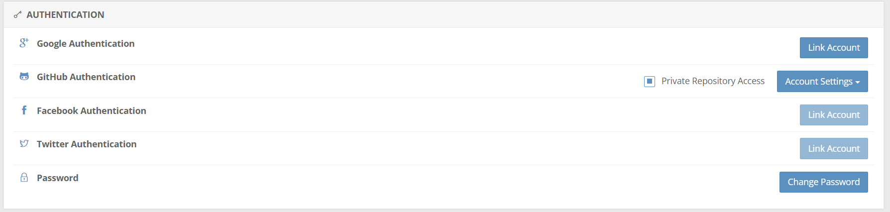

```{r, include = FALSE}
knitr::opts_chunk$set(
  collapse = TRUE,
  comment = "#>"
)
```

```{r setup}
library(cld)
```

# Getting Started

## Preconditions

### Google Fonts

Install necessary fonts from [here](https://fonts.google.com/).

Used fonts (till January 2021) have been:

- Caveat
- Indie Flower
- Permanent Marker
- Amatic SC
- Open Sans

## Installation

Install it from Github.

```{r, eval = FALSE}
devtools::install_github("ims-fhs/cld", ref = "master")
devtools::install_github("ims-fhs/cld", ref = "dev")
devtools::install_github("ims-fhs/cld", ref = "snf")
```


```{r, eval = FALSE}
> devtools::install_github("ims-fhs/cld", ref = "dev")
Downloading GitHub repo ims-fhs/cld@dev
These packages have more recent versions available.
It is recommended to update all of them.
Which would you like to update?

1: All                         
2: CRAN packages only          
3: None                        
4: glue (1.5.0 -> 1.6.0) [CRAN]

Enter one or more numbers, or an empty line to skip updates: 3
```
..don't update the `glue` package. #Dontknowwhy..

# Develop your first narrative


# Tweaking

## Custom Colours

`plot` has a `cp` argument. To plot with custom colours, just provide a `cp` of four colours.

```{r, eval = FALSE}
cp <- c("#D9D0D3", "#FFE18B", "#FBBA00", "#0F0D0E")
plot(cld, cp = Cp)
```


## Custom Fonts

# Deploy a narrative as a shiny app

## Deployment

Always install the `cld` package new and directly from github immediately before deploying the app to shinyapps.io. Otherwise shinyapps won't find the `cld` package.

# Typical Problems

## Importing

> Error in scan(file, what, nmax, sep, dec, quote, skip, nlines, na.strings,  : 
  line X did not have Y elements

This error - explanation see [here](https://stackoverflow.com/questions/19455070/confusing-error-in-r-error-in-scanfile-what-nmax-sep-dec-quote-skip-nli) - may occur, when:

i) some elements of the CLD are not caught by the `cld::import` function. Try eliminating special characters, colouring, comments from the cld and import once again;
ii) - due to some unknown reasons - a once importable cld is not importable any longer. Workaround (January 22): Add the `fill = TRUE` option to the `read.table` call as supposed on [SO]((https://stackoverflow.com/questions/19455070/confusing-error-in-r-error-in-scanfile-what-nmax-sep-dec-quote-skip-nli)

## Deployment

`cld` package not installable (..error message not known at the time of writing this vignette, sorry..). Check, whether your shinyapp account is connected to RStudio and Github.

https://www.shinyapps.io/admin/#/profile



# Known Bugs / Limitations

- Fonts don't work at the moment (January 2021).
